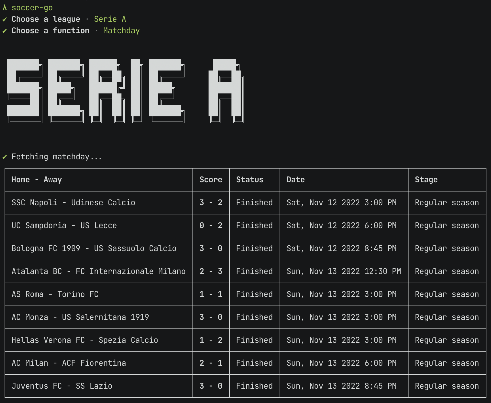
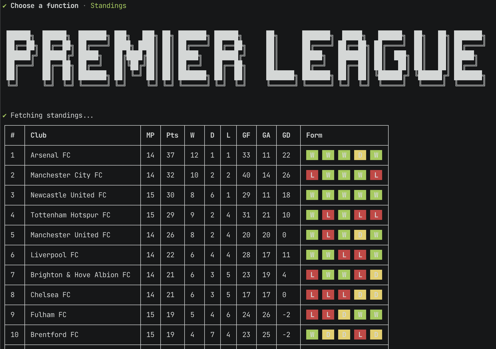
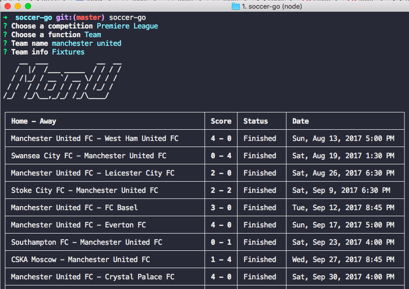

# soccer-go

**soccer-go** is a node command line application to gather soccer stats and results. Heavily inspired by [nba-go](https://github.com/xxhomey19/nba-go).

The app is still in its early stages of development, so do expect bugs and errors. All contributions are very welcome!

## Install

Requirements:

- [Node.js](https://nodejs.org/en/) >= 8
- [football-data](https://www.football-data.org/) API key, which can be obtained [here](https://www.football-data.org/client/register)

You can install **soccer-go** with `npm` or `yarn`:

```
$ npm i -g soccer-go
or
$ yarn global add soccer-go
```

And then set the API key

```
$ export SOCCER_GO_API_KEY=<your api key>
```

## Usage

**soccer-go** can be launched globally by typing `soccer-go` or `sgo` in your terminal. It has two modes: **CLI** or **Visual**.

### Visual

Just launch `soccer-go`, you will be then prompted for info.

### CLI

There are 3 main commands:

- [`matchday` or `m`](#matchday)
- [`standings` or `s`](#league-standings)
- [`team` or `t`](#team-fixtures)

Each of these commands will take the league code as first argument. Common ones are

- **PL** - Premier League
- **PD** - Primera Division
- **SA** - Serie A
- **BL1** - Bundesliga
- **FL1** - Ligue 1

You can find the complete list in the visual mode or you can take a look [here](https://github.com/acifani/soccer-go/blob/master/src/constants/leagues.ts).

#### Matchday

**`$ soccer-go matchday <league>`**

> Example: `$ soccer-go matchday SA`



#### League standings

**`$ soccer-go standings <league>`**

> Example: `$ soccer-go standings PL`



#### Team fixtures

**`$ soccer-go team <league> <team> [options]`**

##### Options

- `--fixtures`, `-f`: Print all the **games** played by the team in the current season
- `--players`, `-p`: Show the current **squad**

> Examples:
>
> `$ soccer-go team PL "manchester united" -f`
>
> `$ soccer-go team SA juventus -fp`



... and more.

## Development

If you want to customize or contribute to this package, then running it locally from source is really easy.

```
$ git clone git@github.com:acifani/soccer-go.git
$ cd soccer-go
$ npm i
```

Now you can either run it in watch mode

```
$ npm start
```

Or build everything

```
$ npm run build
```

## To-Dos

- [ ] Extra-time / penalty
- [ ] Head2head
- [ ] Team colors
