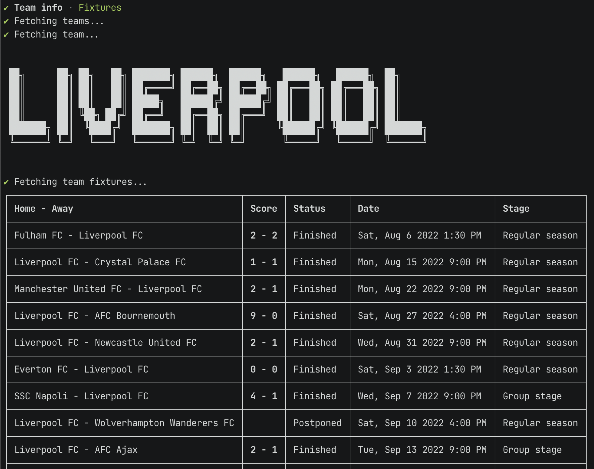

# soccer-go

**soccer-go** is a node command line application to gather soccer stats and results. Heavily inspired by [nba-go](https://github.com/xxhomey19/nba-go).

## Install

Requirements:

- [Node.js](https://nodejs.org/en/) >= 20
- [football-data](https://www.football-data.org/) API key, which can be obtained [here](https://www.football-data.org/client/register)

You can install **soccer-go** with `npm` or `yarn`:

```
$ npm i -g soccer-go
or
$ yarn global add soccer-go
```

And then set the API key

```
$ export SOCCER_GO_API_KEY=<your api key>
```

## Usage

**soccer-go** can be launched globally by typing `soccer-go` or `sgo` in your terminal. It has two modes: **CLI** or **Visual**.

### Visual

Just launch `soccer-go`, you will be then prompted for info.

### CLI

There are 4 main commands:

- [`matchday` or `m`](#matchday)
- [`standings` or `s`](#league-standings)
- [`scorers` or `sc`](#top-scorers)
- [`team` or `t`](#team-fixtures)

Each of these commands will take the league code as first argument. Common ones are

- **PL** - Premier League
- **PD** - Primera Division
- **SA** - Serie A
- **BL1** - Bundesliga
- **FL1** - Ligue 1

### Supported Leagues

**Free tier** (12 leagues):

- PL - Premier League (England)
- ELC - Championship (England)
- PD - Primera División (Spain)
- BL1 - Bundesliga (Germany)
- SA - Serie A (Italy)
- FL1 - Ligue 1 (France)
- DED - Eredivisie (Netherlands)
- PPL - Primeira Liga (Portugal)
- BSA - Série A (Brazil)
- CL - Champions League
- WC - World Cup
- EC - European Championship

<details>
<summary><b>Additional paid tier leagues</b> (requires API subscription - <a href="https://www.football-data.org/pricing">pricing</a>)</summary>

- BL2 - 2. Bundesliga (Germany)
- DFB - DFB-Pokal (Germany)
- EL1 - League One (England)
- FAC - FA Cup (England)
- SB - Serie B (Italy)
- SD - Segunda División (Spain)
- FL2 - Ligue 2 (France)
- EL - Europa League
- CLQ - Champions League Qualification
- MLS - MLS (USA)
- ECF - UEFA Women's Euro

Check the [API coverage](https://www.football-data.org/coverage) for the complete list.

</details>

#### Matchday

**`$ soccer-go matchday <league>`**

> Example: `$ soccer-go matchday SA`


#### League standings

**`$ soccer-go standings <league>`**

> Example: `$ soccer-go standings PL`


#### Top scorers

**`$ soccer-go scorers <league>`**

Display the top goal scorers for a given league, including goals, assists, penalties, and matches played.

> Example: `$ soccer-go scorers PL`


#### Team fixtures

**`$ soccer-go team <league> <team> [options]`**

##### Options

- `--fixtures`, `-f`: Print all the **games** played by the team in the current season
- `--players`, `-p`: Show the current **squad**

> Examples:
>
> `$ soccer-go team PL "manchester united" -f`
>
> `$ soccer-go team SA juventus -fp`



... and more.

## Development

If you want to customize or contribute to this package, then running it locally from source is really easy.

```
$ git clone git@github.com:acifani/soccer-go.git
$ cd soccer-go
$ npm i
```

Now you can either run it in development mode

```
$ npm start
```

Or build everything

```
$ npm run build
```

Run tests and check code quality

```
$ npm test            # Run all tests with linting
$ npm run coverage    # Generate coverage report
$ npm run lint        # Check code style
$ npm run format      # Auto-format with Prettier
```
